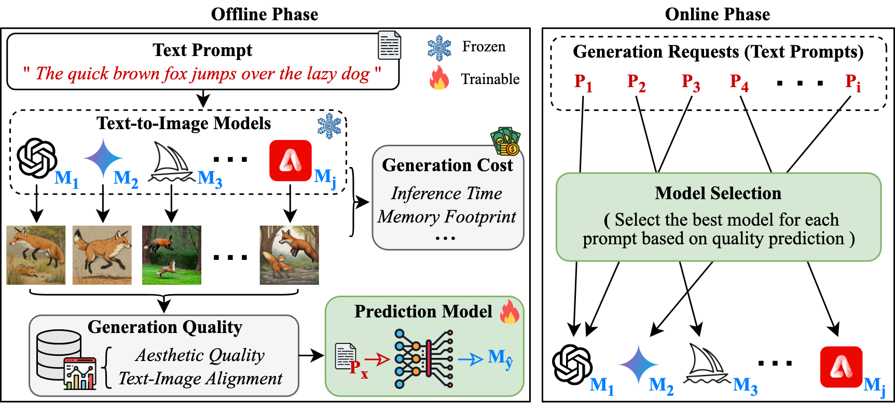

# [CIKM '24] Learning Prompt-Level Quality Variance for Cost-Effective Text-to-Image Generation
This repository contains the code and data for the following paper:
* [Dongkeun Lee](https://codongcodong.github.io/) and [Wonjun Lee](https://netlab.korea.ac.kr/wlee/), “__Learning Prompt-Level Quality Variance for Cost-Effective Text-to-Image Generation__,” to appear in _the 33rd ACM International Conference on Information and Knowledge Management_ (CIKM ’24) - Short Research Paper Track, Boise, ID, USA, October 2024.

Paper link (ACM DL) : [TBA](https://github.com/sco-edge/CEMS/tree/main)   
Author Preprint : [PDF](https://codongcodong.github.io/pdf/CIKM24_CEMS_paper.pdf)

## Overview


## Datasets
### Dataset Collection
We collect __prompt-level__ text-to-image performance dataset by generating images using state-of-the-art models with diverse sets of prompts. To minimize the effect of randomness on image synthesis, we generate three images per prompt and compute the average quality. All models generate images of size 512 × 512. The machine used in our experiment has a GeForce RTX 2080 Ti GPU and an Intel i7-8700K CPU with 16 GB of RAM.

### Benchmark Prompts (Prompt_Datasets)
We use all prompts from LN-COCO, DrawBench, and PartiPrompts and randomly sample 31,427 and 8,168 prompts from MS-COCO and DiffusionDB, respectively.

| Benchmarks | # of Prompts | # of Words/Prompt ($\mu$(±$\sigma$))|
|:---:|:---:|:---:|
|[MS-COCO](https://cocodataset.org/#download)|31,427|10.46 (±2.41)|
|[LN-COCO](https://google.github.io/localized-narratives/)|8,573|40.45 (±18.75)|
|[DrawBench](https://docs.google.com/spreadsheets/d/1y7nAbmR4FREi6npB1u-Bo3GFdwdOPYJc617rBOxIRHY/edit#gid=0)|200|11.68 (±9.62)|
|[PartiPrompts](https://github.com/google-research/parti/tree/main)|1,632|9.12 (±7.34)|
|[DiffusionDB](https://huggingface.co/datasets/poloclub/diffusiondb)|8,168|24.31 (±16.10)|

### Text-to-Image Performance Dataset (Model_Perf)
| Model | [NIMA Score](https://github.com/idealo/image-quality-assessment) $\uparrow$ | [CLIP Score](https://huggingface.co/laion/CLIP-ViT-g-14-laion2B-s12B-b42K) $\uparrow$ | Inference Speed <br> ($\mu$(±$\sigma$)) |
|:---:|:---:|:---:|:---:|
|[SDXL-Turbo](https://huggingface.co/stabilityai/sdxl-turbo)|5.405|33.59|0.616 s (±0.071)|
|[SD-Turbo](https://huggingface.co/stabilityai/sd-turbo)|5.292|33.34|0.176 s (±0.018)|
|[aMUSEd](https://huggingface.co/amused/amused-512)|5.024|30.09|0.489 s (±0.047)|
|[TAESD](https://github.com/madebyollin/taesd)|5.397|32.90|1.588 s (±0.053)|

## Requirements
Our code has been tested running under Python 3.8.19 with the following packages installed:
```
numpy==1.24.3
pandas==2.0.3
datasets==2.16.1
scikit-learn==1.3.2
torch==2.2.1
transformers==4.44.0
accelerate==0.33.0
```

## How to run
#### 1. Train the CLIP-based quality prediction model
```
python quality_prediction.py (<SCORE_TYPE>)
```
* SCORE_TYPE : nima (default), clip, mixed

#### 2. Evaluate its cost effectiveness (Eval_Cost_Effect)
```
# Cost effectivness using nima/clip score
python Eval_Cost_Effect/avg_quality_cost.py (<SCORE_TYPE>)

# Cost effectivness using mixed score
python Eval_Cost_Effect/avg_quality_cost_mixed.py
```
* SCORE_TYPE : nima (default), clip

## Contact
If you have any questions, please contact the author [Dongkeun Lee](https://codongcodong.github.io/).

## Citation
TBA